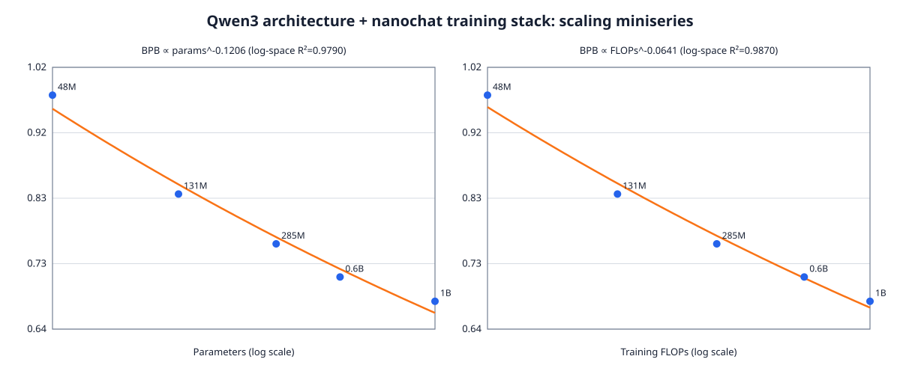

# Qwen3 architecture on nanochat: pretraining and scaling report

## Summary

This repository now supports hard-coded Qwen3-family model shapes while keeping
the rest of nanochat unchanged: nanochat's trained 32K tokenizer, ClimbMix data,
training loop, MuonAdamW optimizer, evaluation, and checkpoint format. Two main
models and three smaller scaling points were trained on a 4-node, 32-H100 Ray
cluster.

The small points form an approximately 50-token-per-parameter miniseries. They
show a smooth reduction in validation bits per byte (BPB) as parameter count
and training compute increase. The existing 0.6B run used more data (63.29
tokens/parameter), while the 1B run is close to the same 50-token ratio.



## Experimental setup

- Hardware: 4 Ray nodes, 8 H100 80GB GPUs per node (32 GPUs total).
- Architecture: Qwen3 decoder blocks with RMSNorm, Q/K normalization, RoPE
  (`theta=1,000,000`), GQA, and SiLU gated MLPs. Embedding and LM-head weights
  are tied.
- Tokenizer: nanochat-trained tokenizer, vocabulary size 32,768. No Qwen
  tokenizer or pretrained weights are used.
- Data and loader: nanochat ClimbMix pipeline.
- Optimizer: nanochat MuonAdamW; matrix LR 0.02, embedding/scalar LR 0.0003,
  weight decay 0.28.
- Schedule: 200 warmup steps, 65% warmdown, final LR fraction 0.05.
- Sequence length: 4,096.
- Global batch: 2,097,152 tokens; per-GPU batch 2, with gradient accumulation.
- Validation: 4,194,304 tokens; the table reports the final validation BPB.
- Precision: BF16; FP8 disabled.

## Results

Parameter counts are unique trainable parameters with the tied 32K embedding.
FLOPs are nanochat's training estimate, including attention at sequence length
4,096. Training time excludes Ray startup, final serialization, and HDFS sync.

| Model | Shape (hidden / MLP / layers / Q:KV) | Parameters | Tokens | Tokens / param | Training FLOPs | Validation BPB | Training time |
|---|---:|---:|---:|---:|---:|---:|---:|
| 48M | 512 / 1,536 / 8 / 8:4 | 48,245,248 | 2,411,724,800 | 49.99 | 1.669 EF | 0.976471 | 3m 41s |
| 131M | 768 / 2,304 / 12 / 12:6 | 131,356,416 | 6,568,280,064 | 50.00 | 11.126 EF | 0.834179 | 17m 31s |
| 285M | 1,024 / 3,072 / 16 / 16:8 | 285,250,560 | 14,262,730,752 | 50.00 | 47.379 EF | 0.762561 | 1h 04m 23s |
| 0.6B | 1,024 / 3,072 / 28 / 16:8 | 474,021,888 | 29,999,759,360 | 63.29 | 169.868 EF | 0.714904 | 3h 54m 35s |
| 1B | 1,536 / 5,376 / 28 / 16:8 | 1,008,300,544 | 50,000,297,984 | 49.59 | 443.393 EF | 0.679903 | 9h 04m 40s |

EF means exaFLOPs (`1e18` floating-point operations).

## Empirical scaling fit

Across all five measured points, an ordinary least-squares fit in log space
gives:

```text
validation BPB = 8.08078 * parameters^-0.120596     (R² = 0.978973)
validation BPB = 14.1184 * training_FLOPs^-0.064087 (R² = 0.987003)
```

The three new strictly matched points improve from 0.976471 BPB at 48M to
0.762561 BPB at 285M, a 21.9% reduction. The complete five-point compute fit
has a log-space R² of 0.9870 over 1.669 to 443.393 exaFLOPs. The three points
within 49.8–50.2 tokens/parameter alone give `BPB = 22.0041 * FLOPs^-0.074359`
with R² = 0.993668. In this measured
range, a 10x increase in training compute corresponds to a factor of
`10^-0.064087 = 0.863` in BPB (about a 13.7% reduction) for the five-point fit.

This is a fixed-token/parameter scaling miniseries, not an isoFLOP sweep. It is
useful for estimating the observed loss trend for this exact architecture,
tokenizer, data mixture, optimizer, and schedule. It is not sufficient to
identify a compute-optimal parameter/data frontier: that would require several
parameter/data allocations at each compute budget. The 0.6B point's higher
token ratio is another reason not to interpret the parameter-only fit as a
universal law.

## Checkpoints and storage

Durable outputs are under:

```text
hdfs://harunavaali/home/byte_search_aisearch_strategy/wenjiedu/nanochat/base_checkpoints/
```

The main model directories are `qwen3-0.6b-30b` and `qwen3-1b-50b`. Scaling
directories are `qwen3-scale-48m-2.4b`, `qwen3-scale-131m-6.6b`, and
`qwen3-scale-285m-14.3b`. Scaling measurements save only the final model and
JSON metadata and omit optimizer shards. This prevents checkpoint history from
filling worker-local storage.

The exported 1B Transformers checkpoint is available at
[Kurt232/nanochat-qwen3-1b-50b](https://huggingface.co/Kurt232/nanochat-qwen3-1b-50b).

## Reproduction

Launch the three scaling points sequentially on an existing 32-GPU Ray cluster:

```bash
export NANOCHAT_BASE_DIR=/opt/tiger/nanochat_runtime
export NANOCHAT_STORAGE_URI=hdfs://harunavaali/home/byte_search_aisearch_strategy/wenjiedu/nanochat
bash runs/qwen3_scaling_ray.sh
```

The launcher skips a point whose final model and metadata already exist on
HDFS. Recreate the checked-in SVG and print the fitted coefficients with:

```bash
python dev/qwen3_scaling_analysis.py
```

Raw values are in [`qwen3_scaling_results.csv`](qwen3_scaling_results.csv).
